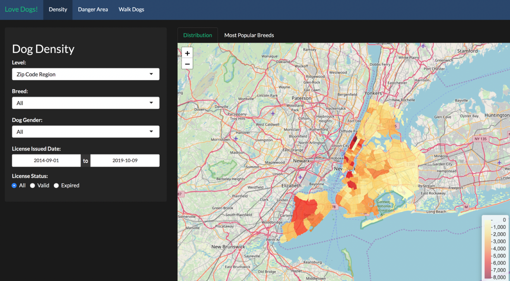

# Project 2: Shiny App Development Version 2.0

## Project Title: Lovely? Danger? Dogs in NYC!
Term: Fall 2019

+ Team: Section1 Group5
+ Team members:
	+ Syed Ahsan Bukhari (sab2302)
	+ Haofeng Chen (hc2962)
	+ Qichao Chen (qc2254)
	+ Yanling Dai (yd2456)
	+ Yifan Yang (yy2955)
+ **Project summary**: Dog has been an important partner for many people’s daily life. Dogs are so beloved that owners often consider them as their own children and name them according to their unique personalities. According to the New York City Economic Development Corporation, there are around 600,000 dogs in NYC. Therefore, in this project, we are interested to look deeper into the dog population in NYC. The target users for our shiny app are pet retailers, dog lovers, and non-dog lovers. More specifically, for a pet retailer opening a new store in NYC, they may interest to see the dog density in each area of the city and find the store locations which are surrounded by numerous of dog owners. In addition, by looking at the dog breed distribution in the associated area, a local pet retailer could decide its store inventories to meet the needs of the popular dog breed in its regions. On the other hand, for the individual user, if you are a dog lover that recently move to New York, you may want to move to a dog-friendly neighborhood so that it will suit for you and your dog, and the dog density information on our app can help you on such decisions. For non-dog lovers, you may try to avoid walking in dog-dense areas. Also, our danger zone provides information for non-dog lovers about dog bite incidents information for each area and the associated dog bite statistic by breed. Non-dog lovers may also want to pay attention to those danger areas and dangerous breeds.

## Contribution statement

This section lists the contribution and tasks for each member.

1. Data Exploration & Cleaning - Bukhari, Syed Ahsan sab2302@columbia.edu

   * Updated Breed Name and made top 20 of 70% data

   * Updated Data Types ( like date, numeric etc)

   * Added Longitude, Latitude, City, County

   * Few additional column for analysis like Age, Expiry year etc

   * converted clean dataset copy as "RDS" - which will be used for app. 

   * App Testing: Data Quality and Projection accuracy  

2. Shiny app Developer - Chen, Haofeng hc2962@columbia.edu

   * Mapped the data’s zip code to the associated boroughs, districts and geocode

   * Developed the density page of the shiny app 

   * Wrote the project report

   * Provided guidance on the project ppt. 

3. Prototype Design - Chen, Qichao qc2254@columbia.edu

   * Cleaned the dataset and updated population density column

   * Mainly developed prototype of the density page 

4. Documentation & Presentation - Dai, Yanling yd2456@columbia.edu

   * Developed slides and the data story.

   * Gave the presentation.

5. Lead Shiny app Developer - Yang, Yifan yy2955@columbia.edu

   * Collected most datasets and geographical files

   * Did the final cleaning for all data before applying data to the application

   * Built the shiny app application (all parts)

     * Map-based heat map

     * Interactive filters

     * Bar charts

   * wrote group meeting record

   * Managed project folder structure and README format

## Group Meeting Record

* Meeting 1 on September 23

  1. Brainstorm on the topic/dataset of the project
  2. Feasible plan division of work:
     1. Data collection & data preprocessing
     2. Building the Shiny App
     3. Writing report & Presentation

  Next steps: check more datasets and come up with more topics

* Meeting 2 on September 25

  1. Discussed datasets and ideas

  2. Finalized with the discussion of the Dog License datasets.

  Next steps: 

  * Think about what we can do using this dataset only

  * Try to figure out more valuable visualization ideas if combined with other datasets. And find the link of related datasets if possible

  * Prototype some visualization results using any tools

* Meeting 3 on October 2

  1. Potential visualization topics for our shiny app

  2. Added 3 more datasets to the projects. 

  3. Basic layout of the Shiny app

  4. Task assignment for each group member 

* Meeting 4 on October 6

  1. Updates on everyone’s progress

  2. Problems that each group member faced so far and feasible solutions for those problems

  3. Share ideas on the UI design

  4. Assign the remaining tasks to each group member 

* Meeting 5 on October 8

  1. Presented the project’s progress and the current bugs we experienced

  2. Discuss each group member’s contribution 

  3. Briefly went through the presentation slides.

